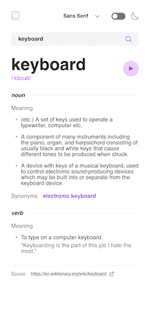
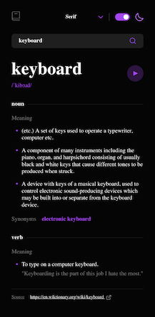
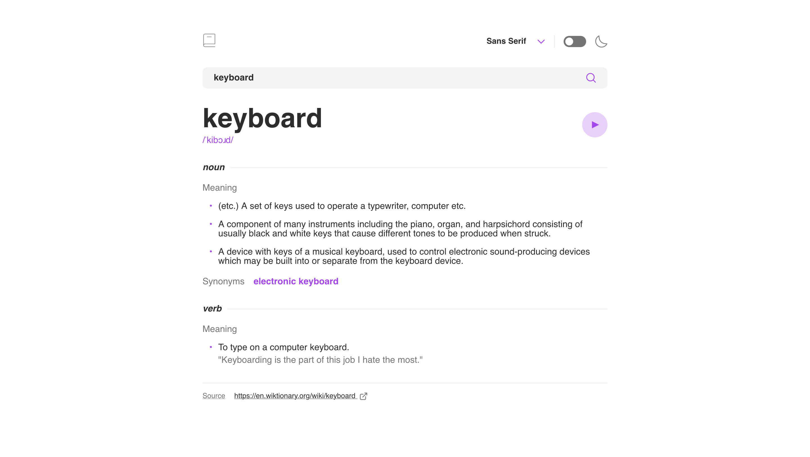

# Todo app solution

This is a solution to the [Dictionary web app challenge on Frontend Mentor](https://www.frontendmentor.io/challenges/dictionary-web-app-h5wwnyuKFL).

## Table of contents

- [Overview](#overview)
  - [The challenge](#the-challenge)
  - [Screenshot](#screenshot)
  - [Links](#links)
  - [Built with](#built-with)
- [Author](#author)

## Overview

### The challenge

Users should be able to:

- Search for words using the input field
- See the Free Dictionary API's response for the searched word
- See a form validation message when trying to submit a blank form
- Play the audio file for a word when it's available
- Switch between serif, sans serif, and monospace fonts
- Switch between light and dark themes
- View the optimal layout for the interface depending on their device's screen size
- See hover and focus states for all interactive elements on the page

### Screenshots

 

### Links

- Solution URL: [Solution URL here](https://github.com/irinebthayil/dictionary)
- Live Site URL: [Live site URL here](http://irinebthayil.github.io/dictionary)

### Built with

- [React](https://reactjs.org/) - JS library
- Fetch
- Flexbox
- Mobile-first workflow

## Author

- Github - [Irine B Thayil](https://github.com/irinebthayil)
- Frontend Mentor - [@irinebthayil](https://www.frontendmentor.io/profile/irinebthayil)
- LinkedIn - [Irine B Thayil](https://www.linkedin.com/in/irinebthayil/)